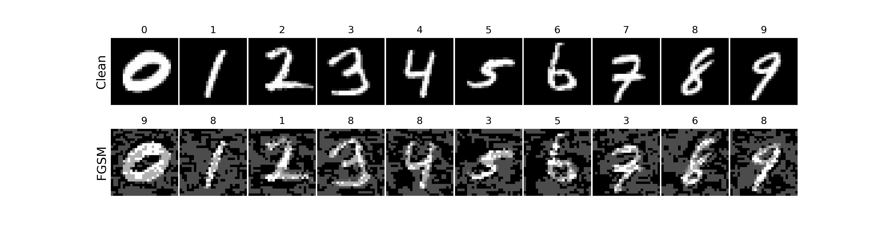

# AI2019 Tutorial on Adversarial Machine Learning
This is the repository for tutorial on Adversarial Machine Learning at [The 32nd Australasian Joint Conference on Artificial Intelligence, 2-5 Dec 2019 Adelaide Australia](http://nugget.unisa.edu.au/AI2019/index.php#)

**Presentors**: 

* [Xingjun Ma](http://xingjunma.com/) (University of Melbourne)

* [Sarah Erfani](https://people.eng.unimelb.edu.au/smonazam/) (University of Melbourne)

**Slides**: [GoogleDrive]()

**A step-by-step demo for crafting adversarial examples on MNIST**: [jupyter notebook](demo__adversarial_examples_MNIST.ipynb)

The crafted adversarial images (bottom) by the Fast Grident Sign Method will look like this:

## Prerequisites
* Python (3.6.4)

* Keras (2.2.4)

* numpy

*[cleverhans (3.0.1)](https://github.com/tensorflow/cleverhans)
